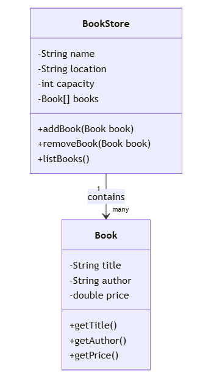

# [Java](../../) - OOP - Encapsulation

### Learning Objectives:

- Implement Encapsulation, Define getter and setter
- Create object instances using Java constructors
- Access and Update the data members using getter and setter methods

---
#### Example 1: Book and BookStore

