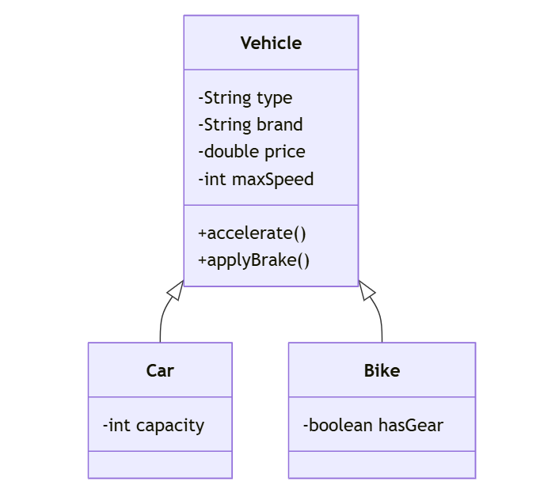

# [Java](../../) - OOP - Inheritance

### Learning Objectives:

- Implement Inheritance, Define getter and setter
- Create object instances for both parent and child classes
- Implement toString and print the objects in console

---
#### Example 1: Car and Bike

