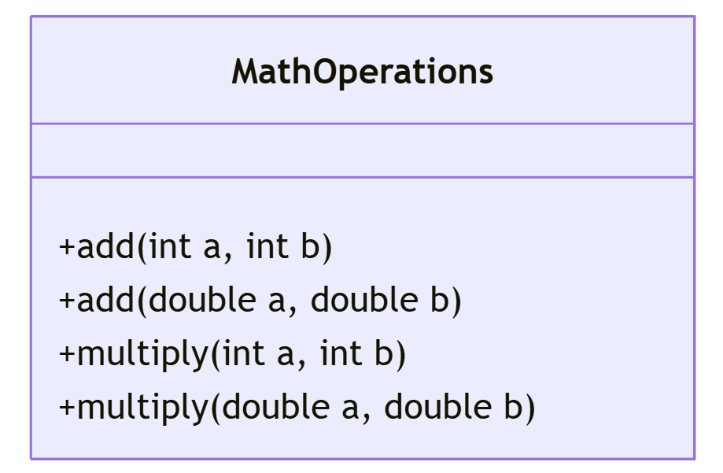
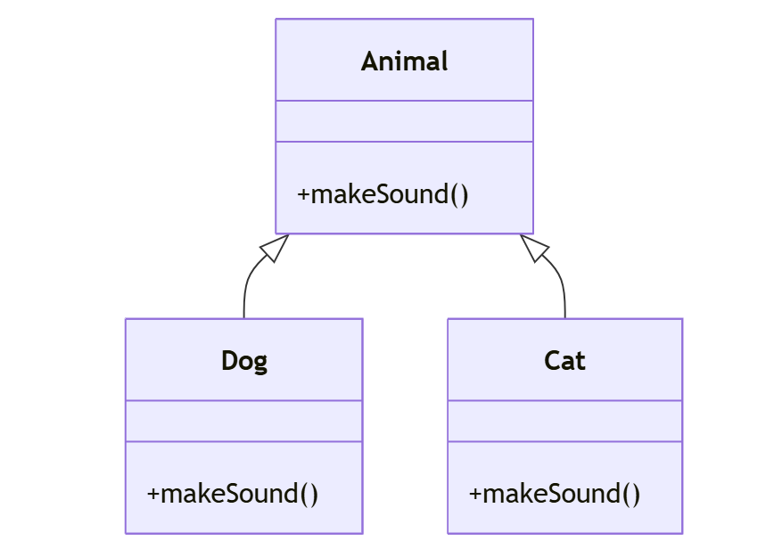

# [Java](../../) - OOP - Polymorphism

### Learning Objectives:

- Implement Method Overloading, Demonstrate the use case
- Implement Method Overriding, Demonstrate the use case

---
#### Example 1: Math Operations

---
#### Example 2: Animal > Cat, Dog

