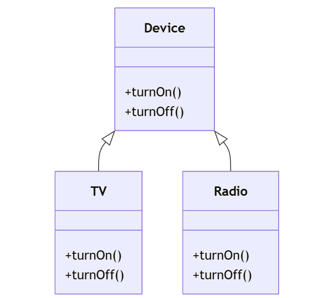
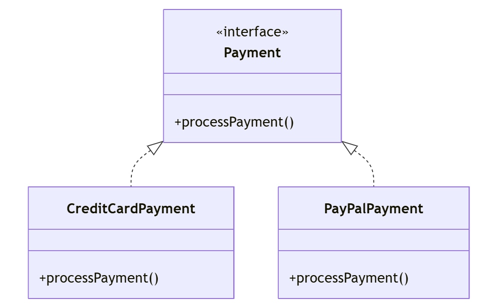

# [Java](../../) - OOP - Abstraction

### Learning Objectives:

- Implement Abstraction using Abstract Class
- Implement Abstraction using Interface

---
#### Example 1: Device > TV, Radio

---
#### Example 2: Payment Interface

