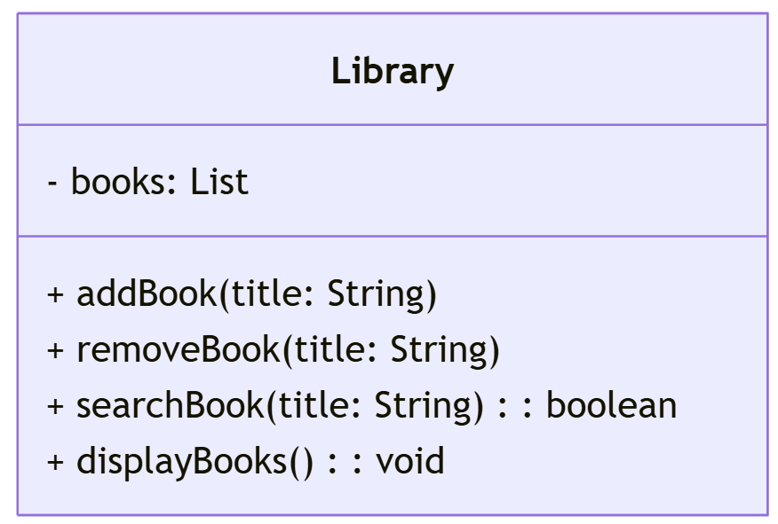
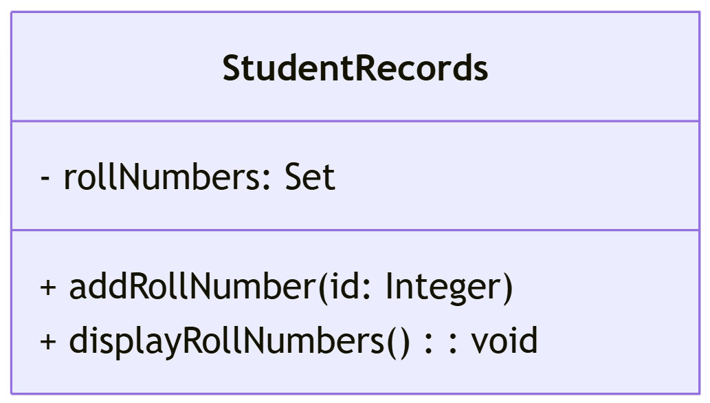
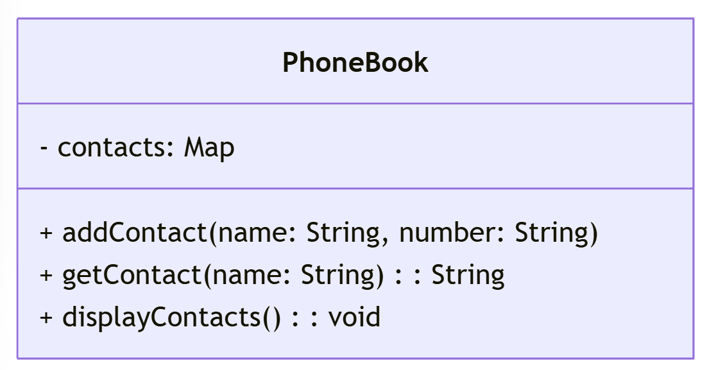

# [Java](../../) - Collections - Basic

# Java Collections - Hands-on Exercises

## Learning Objectives

- Understand how to use `List`, `Set`, and `Map` in Java.
- Implement real-world scenarios using Java Collections.
- Practice retrieving, updating, and manipulating collections.

---

## Exercise 1: Managing a Library (Using `List`)

### Problem Statement
A library needs a system to store a list of available books. Implement a `List` to store book titles and perform the following operations:

1. Add books to the library.
2. Display all books.
3. Remove a specific book.
4. Search for a book by title.

### Input & Output
#### Input:
- A list of book titles.
- A title to remove.
- A title to search.

#### Expected Output:
- The list of books after addition.
- The list of books after removal.
- A message indicating whether a book is found or not.

---

## Exercise 2: Unique Student Roll Numbers (Using `Set`)

### Problem Statement
A university stores student roll numbers and wants to ensure that duplicate entries are not added. Implement a `Set` to store roll numbers and perform the following:

1. Add new roll numbers.
2. Display all roll numbers.
3. Attempt to add a duplicate roll number and observe the output.

### Input & Output
#### Input:
- A set of student roll numbers.
- A roll number to add.

#### Expected Output:
- The set of roll numbers after adding elements.
- No duplicate roll numbers should be present.

---

## Exercise 3: Phonebook Directory (Using `Map`)

### Problem Statement
A phonebook application stores contacts with names and phone numbers. Implement a `Map` to store contact details and perform the following:

1. Add contacts to the phonebook.
2. Retrieve a contact’s phone number using the name.
3. Display all contacts.

### Input & Output
#### Input:
- A set of name-phone number pairs.
- A name to search.

#### Expected Output:
- The list of contacts after addition.
- The phone number associated with a given name.

---

## Java Collections - Sorting Exercises

## Exercise 4: Sorting Books by Title (Using `Comparable`)

### Problem
A library needs to sort books by title in alphabetical order. Implement the `Comparable` interface to allow sorting of book objects.

1. Define a `Book` class with title and author.
2. Implement the `Comparable` interface to sort books by title.
3. Add books to a `List` and sort them.
4. Display the sorted list.

### Input & Output
#### Input:
- A list of books with title and author.

#### Expected Output:
- The list of books sorted by title.

---

## Exercise 5: Sorting Students by Age (Using `Comparator`)

### Problem
A university maintains student records and needs to sort them by age. Implement the `Comparator` interface for custom sorting.

1. Define a `Student` class with name and age.
2. Create a `Comparator` implementation to sort students by age.
3. Add students to a `List` and sort them.
4. Display the sorted list.

### Input & Output
#### Input:
- A list of students with name and age.

#### Expected Output:
- The list of students sorted by age in ascending order.

---

## Exercise 6: Sorting Products by Price (Using `Comparator` with Lambda)

### Problem
An e-commerce store needs to sort products by price. Use Java 8 lambdas to define the sorting logic.

1. Define a `Product` class with name and price.
2. Use a lambda expression to sort products by price.
3. Add products to a `List` and sort them.
4. Display the sorted list.

### Input & Output
#### Input:
- A list of products with name and price.

#### Expected Output:
- The list of products sorted by price in ascending order.

---

[← Excercise 11](../11-abstraction) | [Next Topic TBD →](../next-topic)

---

🔗 **Related Topics:**
- [Collections](../collections/)
- [ArrayList](../arraylist)
- [Sorting Collections](../sorting)
- [Streams API](../streams)
---

